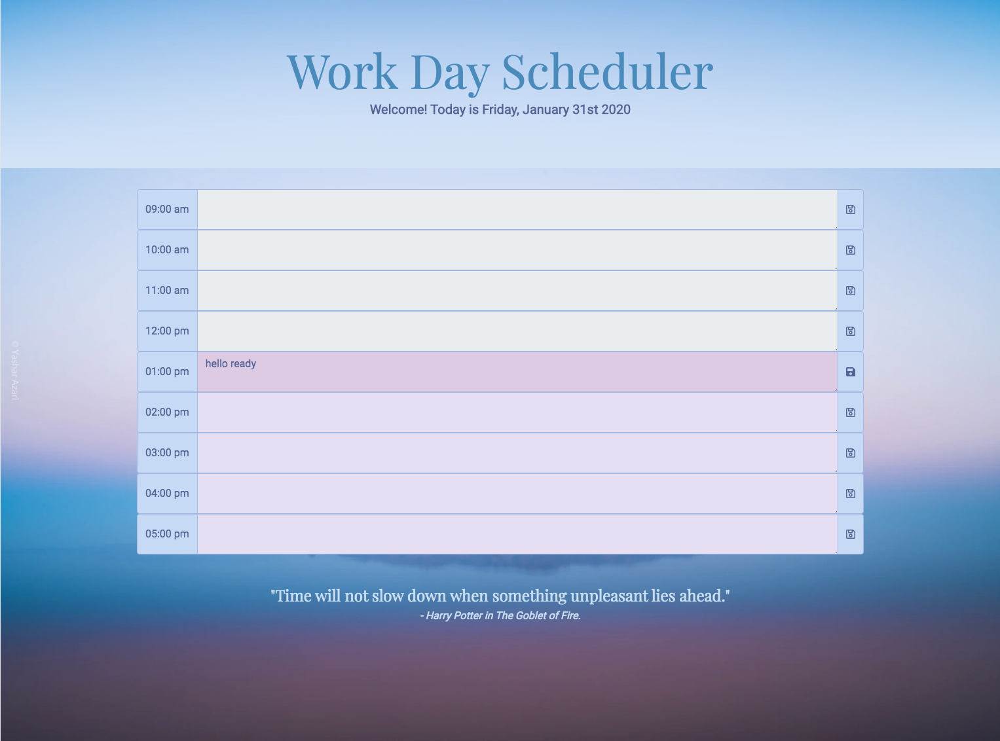

# Work Day Scheduler

***Author: Enid Soto***

This simple application allows the user to schedule daily tasks during business hours (9am to 5pm). 

## Purpose

The purpose of this project is to get familiar with the jQuery and Moment.js javascript libraries. It was an assignment of the UM Full Stack Developer Bootcamp 2019-2020.

## Technologies used

The application's interface was built with *Bootstrap 4* and custom css styles. The functionality was implemented with jQuery and Moment.js.

## Functionality

1. In the header, the user can see the current date.
2. There are 8 boxes where the user can enter a task for each hour of the working day.
3. There is a "save" icon for each hour. When pressed, it stores the task in the browser's local storage. If the page reloads, it will display any saved messages.
4. The user will be unable to enter a task for a time of day that has passed.

## User interface

## Link to the deployed application

You can find the deployed application [here](https://enma1009.github.io/day-planner/)